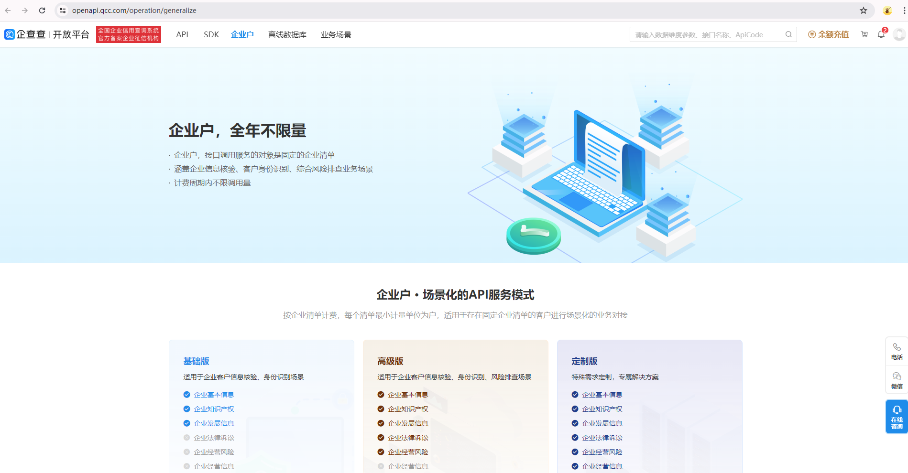
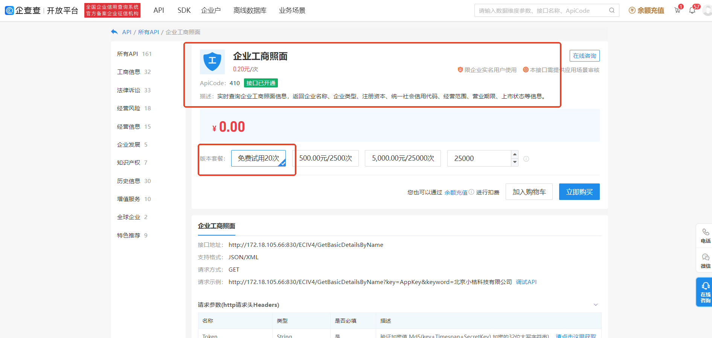
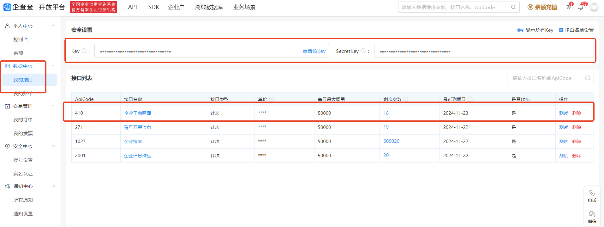
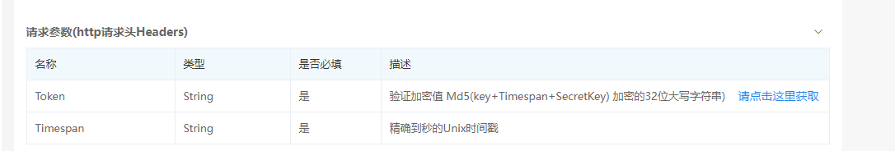
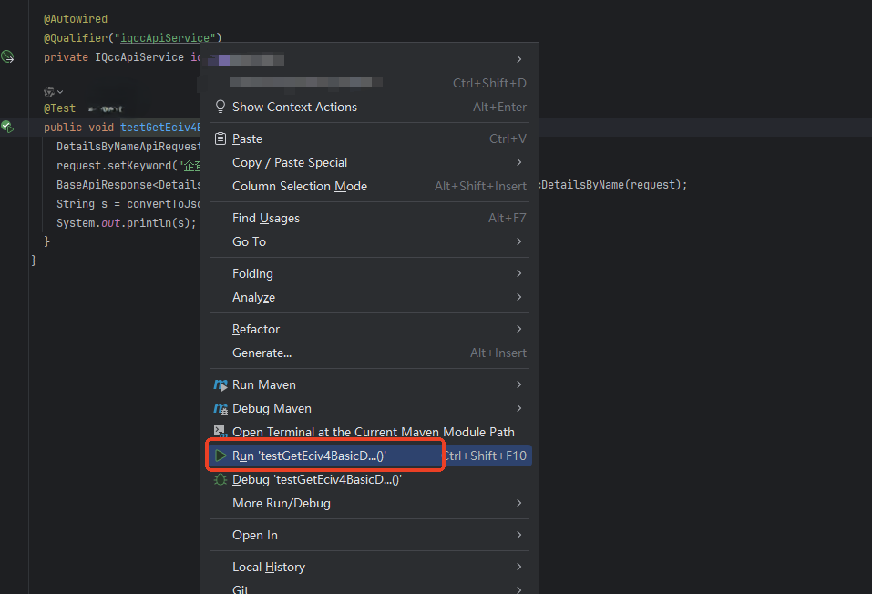

# 企查查 API 接入
## 项目介绍
业务需求需要调用企查查接口，本项目基于企查查接口，封装了企查查接口，方便业务使用。
对接过程中遇到一些问题，记录下来，方便以后使用。

## 项目导入

使用IDEA 导入本项目，选择Maven项目

## 数据准备

### 账号注册


[登录/注册](https://openapi.qcc.com?source=send_a_sunflower)

### 410接口申请



* 选择试用20次，点击立即购买，按照流程购买即可 [410接口申请](https://openapi.qcc.com/dataApi/410?source=send_a_sunflower)

### 接口申请结果与、Key和SecretKey 准备

- 数据中心、我的接口获取 [Key获取](https://openapi.qcc.com/manage/data/interface?source=send_a_sunflower)
- 接口列表中存在 410接口

* 

## 配置参数修改

* 修改类配置：QccApiServiceConfig

```java
    ApiClientConfigurationBuilder configuration = ApiClientConfiguration.builder()
        .key("********") // 对应Key
        .secretKey("********") // 对应SecretKey
        .tokeAlgorithm(EncryptionAlgorithm.MD5) // Token 加密方式 支持自定义
        .domain("https://api.qichacha.com") // 域名
        // 状态码转化器设置，支持自定义
        .apiStatusCodeConfig(new ApiStatusCodeConfig(new DefaultErrorCodeLoader("msg/qcc_errors_convert.config"))); 
```

* Token 加密规则说明
  

- [加密规则](https://openapi.qcc.com/dataApi/410?source=send_a_sunflower)

* 状态码转义
- API接口返回的状态码比较多，通过统一配置文件转化为业务状态码，方便状态码管理
- [状态码配置文件](src/main/resources/msg/qcc_errors_convert.config)

## 单元测试

[QccApiServiceImplTest.java](src%2Ftest%2Fjava%2Fcom%2Forg%2Fqcc%2Fdataapi%2Fapi%2Fimpl%2FQccApiServiceImplTest.java)
执行单元测试，选择 testGetEciv4BasicDetailsByNameApiResponse 方法


## 其他说明

* 默认使用UTF-8编码，如有需要，请自行修改编码格式
* 本版本是初始化版本还有很多功能未完善，后续会不断完善,仅供使用参考

## 相关引用

* [接口详情](https://openapi.qcc.com/dataApi/410?source=send_a_sunflower)
* [请求状态码](https://openapi.qcc.com/services/after/status?source=send_a_sunflower)

